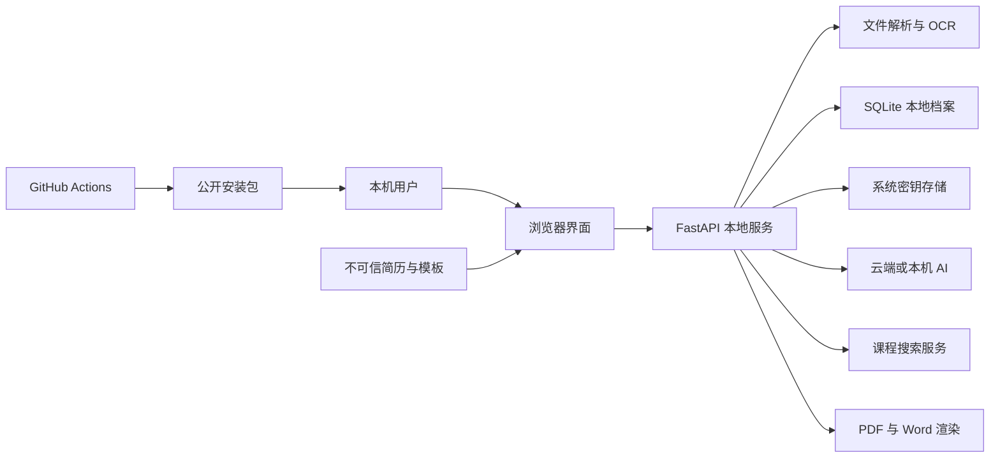

# 简历工坊威胁模型

## Executive summary

简历工坊是单机单用户、仅监听回环地址的本地 Web 应用，公网攻击面较小；最高风险集中在用户从互联网取得并导入的恶意 Office/PDF/图片、未付费签名的安装包供应链，以及用户主动发送到第三方 AI 的敏感职业材料。现有 Host/Origin 门禁、请求大小限制、系统密钥存储、内容脱敏、SHA-256 和构建证明降低了风险，但第三方解析库漏洞、未签名安装包和自定义模型端点仍保留中高残余风险。

## Scope and assumptions

- 范围：`app/`、`web/`、`packaging/`、`.github/workflows/` 及直接相关测试和发布文档。
- 已确认用途：陌生用户在 Windows/macOS 单机使用；无账户、无多租户、无公网部署；资料包含姓名、联系方式、工作与教育经历等高敏感个人信息。
- 已确认联网：用户主动调用所选 AI/搜索服务或手动检查更新；无遥测、无自动崩溃上报。
- 已确认分发：GitHub Releases 提供 Windows 与 macOS 成品；当前无付费 Windows/macOS 代码签名。
- 不在范围：用户操作系统已被恶意软件控制、第三方 AI 服务内部安全、GitHub 平台本身被完全攻破、未来 SaaS/局域网多人部署。
- 当前无会改变评级的开放问题。若未来监听非回环地址、增加登录/多人共享或自动更新，必须重新建模。

## System model

### Primary components

- 浏览器中文前端负责文件选择、结构化编辑、岗位版本、预览和主动 AI 操作（`web/app.js`）。
- FastAPI 本地服务暴露状态、导入、AI、预览、导出和备份 API（`app/main.py`）。
- Office/PDF/图片解析与 OCR 在本机执行（`app/parsers.py`）。
- SQLite 保存档案、岗位版本、历史与反馈；API Key 由 DPAPI/钥匙串保护（`app/storage.py`）。
- 统一模型适配器向云端或本机模型发起 HTTP 请求（`app/providers.py`）。
- PyInstaller/Inno Setup 和 GitHub Actions 构建跨平台发布物（`packaging/`、`.github/workflows/package.yml`）。

### Data flows and trust boundaries

- 用户文件 → 本地解析器：DOCX/PDF/图片/XLSX 字节通过本机 HTTP；限制请求与文件大小，并校验 Office 解压规模、图片像素和 PDF 页数，但底层第三方解析器仍处理不可信格式。
- 浏览器 → FastAPI：JSON、文件和导出请求通过 `127.0.0.1` HTTP；无登录，依赖回环监听、Host/Origin、请求大小、Pydantic 模型和 CSP 边界。
- FastAPI → SQLite/系统密钥库：高敏感档案写入本机 SQLite；云端 API Key 分服务商写入 Windows DPAPI 或 macOS 钥匙串，备份排除密钥。
- FastAPI → AI/搜索服务：简历文本、JD、材料摘录、学习主题与用户 Key 通过 HTTPS 或用户配置的端点发送；调用由用户主动触发，前端首次云调用确认范围。
- FastAPI → PDF/Word 渲染器：岗位正文进入 HTML/Chromium 或 python-docx；渲染模板转义用户文本并限制一页可读性。
- GitHub Actions → 发布物：标签构建依赖、浏览器与二进制后上传 Releases；提供 SHA-256 和 GitHub artifact attestation，但安装包没有商业代码签名。

#### Diagram

## Assets and security objectives

| Asset | Why it matters | Security objective (C/I/A) |
|---|---|---|
| 基础档案、JD、岗位版本、照片 | 可识别个人身份并影响求职 | C/I/A |
| AI 与搜索 API Key | 泄露会造成费用、配额与账号风险 | C/I |
| 岗位正文与导出文件 | 被篡改或错误生成会直接伤害求职结果 | I/A |
| 本机应用服务与解析进程 | 资源耗尽会导致应用或电脑不可用 | I/A |
| 安装包、源码与发布元数据 | 被替换会在用户电脑执行恶意代码 | I/C |
| 许可、作者身份与支持二维码 | 被冒用会造成用户欺骗和资金损失 | I |

## Attacker model

### Capabilities

- 可制作并传播恶意 DOCX、PDF、图片、XLSX、模板或项目材料，诱导用户主动导入。
- 可控制某个 AI 兼容端点或返回恶意/误导文本；也可在材料中放置提示注入内容。
- 可创建仿冒下载页面、篡改非官方二次分发包，或利用第三方依赖/Action 供应链。
- 远程网站可尝试访问本机 `8877` 端口、DNS rebinding 或跨站请求。

### Non-capabilities

- 默认不能直接从互联网访问仅监听 `127.0.0.1` 的服务。
- 默认不能绕过操作系统账户边界读取 DPAPI/钥匙串；已控制本机账户的恶意软件不在本模型内。
- 不能在未取得仓库写权限的情况下创建官方标签发布；公开 PR 默认没有发布权限。

## Entry points and attack surfaces

| Surface | How reached | Trust boundary | Notes | Evidence (repo path / symbol) |
|---|---|---|---|---|
| 本地 HTTP API | 浏览器或本机进程访问 8877 | 浏览器 → FastAPI | 无身份认证，依赖回环与来源检查 | `app/main.py:protect_local_boundary`, `run` |
| 文件与模板导入 | 用户选择/拖入文件 | 不可信文件 → 解析库 | Office、PDF、图片、OCR 复杂格式 | `app/main.py:import_file`, `analyze_template`; `app/parsers.py` |
| 状态恢复 | 用户导入 JSON 备份 | 不可信 JSON → SQLite | 结构校验有限但使用参数化 SQL | `app/main.py:restore`; `app/storage.py:import_backup` |
| AI 服务设置 | 用户填写端点、模型、Key | 本机设置 → 外部 HTTP | 自定义 URL 可把文本与 Key 发往任意端点 | `app/providers.py:normalize_config`, `request_completion` |
| AI 返回内容 | 服务商响应 JSON/文本 | 外部模型 → 简历状态/UI | 可能提示注入、错误事实或超长响应 | `app/ai.py:_chat`; `web/app.js:renderTailoredContent` |
| PDF/Word 导出 | 用户主动导出 | 状态 → Chromium/docx | HTML 文本转义，第三方渲染器仍是复杂依赖 | `app/renderers.py:render_pdf`, `render_docx` |
| 标签发布 | 维护者推送 `v*` 标签 | GitHub Actions → 用户 | 无商业签名；有校验值和构建证明 | `.github/workflows/package.yml` |
| 手动更新检查 | 关于页点击按钮 | 本地服务 → GitHub API | 固定仓库，只返回版本与固定构造链接 | `app/main.py:update_check` |

## Top abuse paths

1. 攻击者发布“免费简历模板” → 用户导入压缩炸弹或畸形文件 → 解析库耗尽内存或触发已知漏洞 → 应用/本机受影响。
2. 攻击者分发仿冒安装包 → 用户忽略未知开发者警告 → 恶意程序读取本机档案与密钥 → 隐私和账户受损。
3. 用户误配恶意自定义 AI 地址 → 应用携带 Key 和岗位文本发起请求 → 对方窃取凭据与简历内容。
4. 项目材料包含提示注入 → 模型把材料中的指令当作任务 → 生成虚假、泄密或偏离 JD 的简历内容 → 用户误投递。
5. 恶意网页尝试跨站请求本机 API → Host/Origin/CSP 校验拒绝 → 当前仅保留浏览器或代理差异造成的残余风险。
6. 第三方 Action/依赖标签被上游劫持 → 标签构建植入恶意代码 → 官方 Release 成为分发渠道。
7. 用户恢复恶意或极大备份 → 本地状态被覆盖或资源耗尽 → 档案完整性/可用性受损；恢复前快照降低误操作但不能防恶意负载。

## Threat model table

| Threat ID | Threat source | Prerequisites | Threat action | Impact | Impacted assets | Existing controls (evidence) | Gaps | Recommended mitigations | Detection ideas | Likelihood | Impact severity | Priority |
|---|---|---|---|---|---|---|---|---|---|---|---|---|
| TM-001 | 恶意模板/简历提供者 | 用户主动导入文件 | 用压缩炸弹、超大像素、畸形 PDF 或解析器漏洞攻击 | DoS，极端情况下第三方库 RCE | 档案、进程、本机 | 20 MB 请求；Office 解压/条目、图片像素、PDF 页数与渲染像素门禁（`app/parsers.py`） | 仍依赖 PyMuPDF、Pillow、python-docx、OCR 原生库 | 持续更新依赖；增加恶意样本 fuzz；未来将解析移到低权限子进程并设内存/时间上限 | 记录脱敏后的格式、大小和拒绝原因；CI 跑恶意夹具 | medium | high | high |
| TM-002 | 仿冒分发者/供应链攻击者 | 用户从非官方来源下载，或构建依赖被污染 | 替换安装包或在构建中植入代码 | 执行恶意代码并窃取全部本机资料 | 发布物、档案、Key | 官方 Releases、SHA-256、tag-only release、artifact attestation、CodeQL/Dependabot | 无 Authenticode/Developer ID；Actions 使用版本标签而非完整 SHA；pip 无 hash lock | 在预算允许时签名/公证；逐步 pin Action commit SHA 与依赖哈希；发布页写明 `gh attestation verify` | 对 Release 做独立校验；保护标签和 main；审查 Dependabot PR | medium | high | high |
| TM-003 | 恶意或误配 AI 端点 | 用户选择自定义端点并输入 Key | 收集请求头中的 Key 与请求正文 | 凭据和职业隐私泄露 | API Key、档案/JD | 首次云调用按服务商和端点确认并显示 URL；Key 本地保护；URL 禁止嵌入账号密码；非回环端点强制 HTTPS（`web/app.js:ensureAiConsent`; `app/providers.py:normalize_config`） | 仍不能验证自定义端点所有者或其隐私政策 | 在设置中进一步突出实际域名；未来可增加受信任端点白名单模式 | 本地显示最近使用域名和时间但不采集遥测；连接测试不回显 Key | medium | high | high |
| TM-004 | 恶意网页 | 用户同时打开恶意网站与本机应用 | 跨站调用本地 API 或嵌入页面 | 读取/覆盖档案或触发云端费用 | 档案、Key 配额 | 仅回环监听；Host/Origin/大小检查；CSP `frame-ancestors`; 无 CORS 放行（`app/main.py`） | 无随机会话令牌；无 Origin 的本机请求仍可到达 | 保持回环；若浏览器兼容性允许，未来增加启动时随机 token/HttpOnly cookie；不要放宽 Host | 对 403 来源拒绝做本地计数，避免写入敏感值 | low | high | medium |
| TM-005 | 材料作者/模型 | 用户让 AI 阅读不可信文本 | 提示注入或模型幻觉污染岗位正文 | 虚假事实、错误建议、求职声誉损失 | 简历完整性 | 基础档案/岗位正文分离；身份字段保护；证据摘录；导出前检查和首次责任提示（`app/ai.py`, `web/app.js`） | LLM 不能可靠抵抗所有提示注入；用户可能跳过复核 | 系统提示明确材料仅为数据；新增高风险声明差异检查；证据不足内容继续标“个人/模拟项目” | 本地保存变更摘要，突出新增公司/学历/证书/数字 | high | medium | high |
| TM-006 | 本机同账户进程/备份接收者 | 可读用户文件或调用本机端口 | 读取 SQLite/备份，或覆盖状态 | 隐私泄露、档案破坏 | 档案、历史 | 用户目录、备份排除 Key、恢复前快照、参数化 SQL（`app/storage.py`） | SQLite 本身不加密；同账户进程可读 | 文档明确本机账户边界；未来可选数据库加密/应用锁；备份支持用户自行加密 | 显示数据目录和最后恢复时间；保留有限历史 | medium | medium | medium |
| TM-007 | GitHub API/网络中间故障 | 用户主动检查更新 | 返回错误/不可用导致误导 | 用户错过更新或被导向错误版本 | 更新完整性/可用性 | HTTPS、固定 GitHub API 仓库和固定构造 release URL；无自动安装（`app/main.py:update_check`） | 版本比较仅适合当前简单发布序列 | 使用语义版本解析；始终要求用户在官方 Releases 手动下载并验 hash | 更新失败仅显示本地错误，不改变状态 | low | low | low |

## Criticality calibration

- critical：无需用户交互即可从远程代码执行，或官方发布密钥/流水线被完全控制。示例：回环边界绕过后直接执行命令；官方标签构建被静默替换。
- high：需要一次常见用户动作即可造成高敏感档案/Key 泄露或本机代码执行。示例：常见模板触发解析器 RCE；仿冒官方安装包被大量下载；恶意自定义端点窃取 Key。
- medium：造成局部隐私泄露、状态破坏或可恢复 DoS，且有明显前置条件。示例：压缩炸弹使应用崩溃；同账户进程读取未加密 SQLite；提示注入污染待审核草稿。
- low：影响有限、容易恢复或仅影响便利性。示例：手动更新检查暂时不可用；错误版本提示但不自动安装；匿名页面元数据泄露。

## Focus paths for security review

| Path | Why it matters | Related Threat IDs |
|---|---|---|
| `app/main.py` | 本地网络边界、全部 API、更新与导出入口 | TM-003, TM-004, TM-007 |
| `app/parsers.py` | 直接处理不可信 Office/PDF/图片和 OCR | TM-001 |
| `app/providers.py` | 外部端点、Key 请求头、响应和超时 | TM-003, TM-005 |
| `app/ai.py` | 隐私过滤、提示边界、模型输出校验 | TM-003, TM-005 |
| `app/storage.py` | 高敏感 SQLite、DPAPI/钥匙串、备份恢复 | TM-006 |
| `app/renderers.py` | HTML/Chromium 与 DOCX 生成 | TM-001, TM-005 |
| `web/app.js` | CSP 下的 DOM 写入、云调用确认和本地状态 | TM-003, TM-004, TM-005 |
| `.github/workflows/package.yml` | 官方二进制供应链与 Release 权限 | TM-002 |
| `.github/workflows/ci.yml` | PR 验证边界和不写真实数据承诺 | TM-002, TM-006 |
| `packaging/resume_workshop.spec` | 成品包含的代码、浏览器与许可资源 | TM-002 |
| `packaging/windows-installer.iss` | Windows 安装范围与许可确认 | TM-002 |

## Quality check

- [x] 覆盖本地 API、文件/备份导入、AI/搜索、渲染、更新和发布入口。
- [x] 每条运行时和 CI 关键边界至少对应一个威胁。
- [x] 区分运行时、构建/发布与测试代码。
- [x] 使用已确认的单机、单用户、回环监听、高敏感数据和无代码签名背景。
- [x] 明确排除公网 SaaS、多租户和已被本机恶意软件控制的情形。
